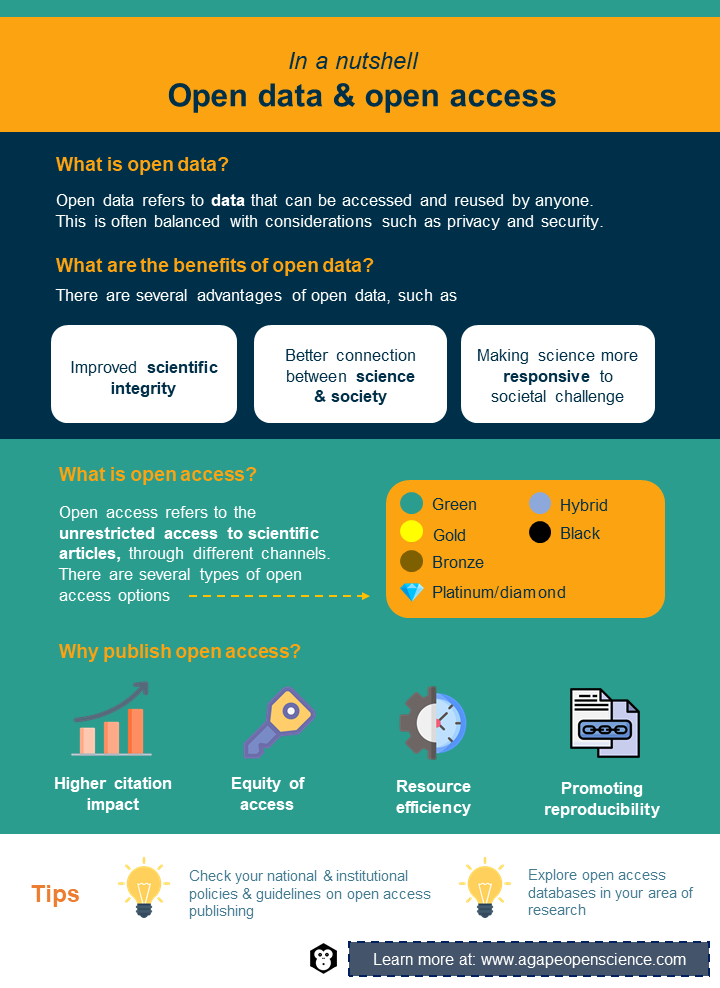

# Open data and open access

::: mainfontFormat
Now, let's have a look at open data and open access. What exactly is it?
:::

## Definitions and history

::: mainfontFormat
"Open data refers to data access and sharing arrangements, where data can be accessed and shared and reused by anyone without technical or legal restrictions, free of charge (to the greatest extent possible) and used by anyone for any purpose subject, at most, to requirements that preserve integrity, provenance, attribution, and openness" ([OECD, 2015](https://www.oecd-ilibrary.org/science-and-technology/making-open-science-a-reality_5jrs2f963zs1-en)). Access to data can occur along a spectrum, with "different degrees of openness, depending on the community of stakeholders involved. 'As open as possible, as closed as necessary' is often used to illustrate the fact that while opening up data can help advance the science, technology and innovation (STI) agenda, this needs to be balanced against issues of costs, privacy, security, intellectual property rights and preventing malevolent uses" ([Paic, 2021](https://goingdigital.oecd.org/data/notes/No13_ToolkitNote_OpenScience.pdf)).

According to the [Open science monitor](https://ec.europa.eu/info/research-and-innovation/strategy/strategy-2020-2024/our-digital-future/open-science/open-science-monitor_en) of the European Commission, the open science scholarly community, open access to publications and open research data comprise the main pillars of open research and open science.

Without open data, scientific research would progress very slowly. The idea of open data stemmed when large international consortia collaborated on complex projects and sharing data became a necessity. You may already be thinking about some of these applications such as oceanography, particle physics, molecular biology or genetics projects. The first significant initiative in data sharing is considered to be the [World Data Center](http://wdc.org.ua/), established in 1957 by the International Council for Science. Its original purpose was to serve the International Geophysical Year, a worldwide effort to study the Earth, oceans and atmosphere in a coordinated and synchronous way ([Korsmo, 2010](https://www.researchgate.net/publication/270166513_The_Origins_and_Principles_of_the_World_Data_Center_System)). Data from many different fields can and should be made open. These include but are not limited to science, finance, business, government, culture, weather and the environment.

It makes sense that research data and scientific publications funded by taxpayers should be open and accessible to the public for free. Arguably, the positive societal impact of free access to scientific knowledge outweighs the investment of time and money. The [European Commission](https://ec.europa.eu/info/research-and-innovation/strategy/strategy-2020-2024/our-digital-future/open-science_en) identifies open science and open access to data as the dominant driver for the future of science, with high expectations of improved scientific integrity, a better connection between science and society and making science more responsive to societal challenges. You can learn more about the benefits of open data and exceptions to this rule in the chapter "Research data". Whilst some of the ideas around open science and open access are really amazing, it also comes with some negatives. You can learn more about this topic in the chapter "Pros and cons".

But let's get back to the topic of this chapter. Where does open access come from and how can it be defined?

Machado ([2015](https://goingdigital.oecd.org/data/notes/No13_ToolkitNote_OpenScience.pdf)) traced the origins of open access to research data that started as anonymous transfers through file transfer protocols (FTPs) within some private networks and exchanging of physical media, such as tapes and disks. This gave rise to the first free access databases of electronic open access data, the [Educational Resources Information Center](http://www.eric.ed.gov/) (ERIC) and [Medlin](https://www.nlm.nih.gov/) (NLM) which are managed by the National Library of Medicine and the National Institute of Health now known under the name [PubMed](http://www.pubmed.gov/), in 1966 in the USA. These were followed by other catalogues of scientific literature and books. Then everything changed in 1990 with the arrival of the internet. Its concept was developed by the [European Laboratory for Particle Physics](https://home.web.cern.ch/) (CERN) as an answer to the ever-increasing needs of particle physicists to exchange large volumes of data ([Berners-Lee](https://www.academia.edu/2148655/World_Wide_Web_The_Information_Universe) [*et al.*, 1992](https://www.academia.edu/2148655/World_Wide_Web_The_Information_Universe)). In the following year, the repository of physics, mathematics and computer science texts [arXiv](http://arxiv.org/) was created, followed by the genetic research database [Genbank](http://www.ncbi.nlm.nih.gov/genbank) in 1992. Since then, databases and repositories have played a key role in open access, allowing the availability of articles, papers and research materials produced by universities and research centres.

What exactly do we understand regarding the term open access? According to the OECD ([2015](https://www.oecd-ilibrary.org/science-and-technology/making-open-science-a-reality_5jrs2f963zs1-en)), open access is "unrestricted online access to scientific articles, via a number of channels, such as institutional repositories, journal publishers' websites, researchers' webpages, etc."
:::

## Types of open access

::: mainfontFormat
Open access (OA) publication means making a publication freely accessible online in a digital format with no barriers to access. There are different types or levels of open access:

-   **Green open access** -- Articles where the author or institution provides access. This is often referred to as self-archiving. Usually, researchers submit their manuscript (published or sometimes unpublished) to an archive. Most institutions provide open access archives. This is usually where preprints are published while undergoing review. Preprints are full drafts of research papers which are currently under peer-review for publication. Researchers choose to share these publicly prior to a completed review to allow for feedback and visibility of their results while they wait to hear back from the journal. It is essential to ensure that the authors comply with the publisher's copyright policy. Some publishers have a standard embargo period before making the work openly accessible. Even in that scenario, meta-data is often exempted from this restriction.

-   **Diamond or platinum open access** -- Journals do not charge either readers or authors directly. Publishers then often require funding from the government or non-for-profit, non-commercial organisations, associations or networks or rely on advertising. The peer-review process is performed by volunteers.

-   **Gold open access** -- Immediate access to an article and data upon publication is provided by a publisher. Publishing costs can be recovered through fees, but more often, an article processing charge is covered by the author, institution or the funding body of which the research is being sponsored. Gold open access provides a rigorous peer review mechanism. More information on publishing gold access can be found on the [PhD on Track](https://www.phdontrack.net/open-science/open-access-publishing/#toc3) website.

-   **Bronze open access** -- The article is free to read only on the publisher's page. However, it lacks the open licence for reuse.

-   **Hybrid open access** -- This is a controversial model in which an author or institution is required to pay the open access article-processing charge to make their paper available open access in a traditional journal which provides a subscription service. It is advised to stay away from this type of open-access publishing as many institutions and funders will not agree to pay a fee.

-   **Black open access** -- Free access to publications behind the paywall when people with access share free copies. This is an unauthorised large-scale copyright infringement. Black open access can take the form of shadow libraries, such as [Sci-Hub](https://en.wikipedia.org/wiki/Sci-Hub) or [Library Genesis](https://en.wikipedia.org/wiki/Library_Genesis). This may also be done by sharing the publication via social media, such as with [#ICanHazPDF](https://en.wikipedia.org/wiki/ICanHazPDF) hash-tag on Twitter.

[Budapest Open Access Initiative](https://www.budapestopenaccessinitiative.org/) defines the terms "gratis" and "libre" in order to distinguish between free to read versus free to reuse. Gratis open Access ({width="9" height="14"}) refers to an online access to read the article free of charge. Similarly, libre open access ({alt="open access"}) refers to an online access to read an article free of charge, however this includes some additional rights to reuse the article under specific [Creative Commons licences](https://en.wikipedia.org/wiki/Creative_Commons_license). Libre open access covers types of open access defined in the [Budapest Open Access Initiative](https://en.wikipedia.org/wiki/Budapest_Open_Access_Initiative), the [Bethesda Statement on Open Access Publishing](https://en.wikipedia.org/wiki/Bethesda_Statement_on_Open_Access_Publishing) and the [Berlin Declaration on Open Access to Knowledge in the Sciences and Humanities](https://en.wikipedia.org/wiki/Berlin_Declaration_on_Open_Access_to_Knowledge_in_the_Sciences_and_Humanities).
:::

## Quid pro quo

::: mainfontFormat
What are the benefits of publishing your studies in open access journals?

Citation is still considered an important metric of influence and impact of academic work and open-access publications are proven to have a higher citation impact ([Langham-Putrow](https://journals.plos.org/plosone/article?id=10.1371/journal.pone.0253129) [*et al.*, 2021](https://journals.plos.org/plosone/article?id=10.1371/journal.pone.0253129)). Open access can also help in other ways. For example, it makes publications and data available to researchers from countries and organisations who cannot afford to pay for access. This allows greater access to current scientific research which can help connect people to find solutions to problems they are targeting. For instance, tackling increasing crop yields to address growing populations during the battle against climate change requires lower socio-economic nations and regions to contribute and collaborate and open access facilitates this.

In order to make data open, it needs to be compliant with legislation, such as General Data Protection Regulation (GDPR) in the EU or cyber security legislation, and follow [FAIR Guiding Principles for scientific data management and stewardship](http://www.nature.com/articles/sdata201618) first published by Wilkinson *et al.* ([2016](https://www.nature.com/articles/sdata201618)). Processing personal data transparently makes publishing and re-use of open data easier and patients or respondents more involved in the research. You will learn more about these principles in the chapter "FAIR principles" and about policies in the chapter "Open science policy, scientific integrity and ethics".

The number of funding agencies and research institutions adopting open science policies is increasing every day, with Europe being in the lead, followed by North America, Asia, Latin America, Oceania and Africa ([ROARMAP, n.d.](https://roarmap.eprints.org/)). Nowadays, about half of published papers are open access and the number keeps increasing. However, it varies greatly based on scientific discipline. In a study of articles published between 2009 and 2015, more than 80% of astronomy, astrophysics, embryology, tropical medicine and fertility papers were available in open access. In contrast, less than 10% of those in pharmacy, applied, inorganic and nuclear chemistry and criminology were open access. This study also unearthed that the dominant category of open access is not green or gold open access, but articles made free to read on the publisher's website, without an explicit open licence ([Piwowar](https://peerj.com/articles/4375/?utm_source=TrendMD&utm_campaign=PeerJ_Tre%20ndMD_0&utm_medium=TrendMD) [*et al.*, 2018](https://peerj.com/articles/4375/?utm_source=TrendMD&utm_campaign=PeerJ_Tre%20ndMD_0&utm_medium=TrendMD)).

We live in an era where data-driven innovation is transforming society, and the need for open science is unanimously recognised in the scientific research community. Governments, funding agencies and institutions recognise the benefits of open science and open research and are steadily developing strategies, policies and guidelines as groundwork for its existence. Since the original OECD Recommendation was adopted in 2006, many of these policies have been implemented at national and institutional levels and have contributed to significant advancement in this area and open science and open data have become mainstream. At least 58 countries have adopted dedicated national strategies and policies for open data and publications ([EC/OECD, 2018](https://stip.oecd.org/stip.html)). This has had a significant impact in areas such as the reproducibility of scientific results, diffusion of knowledge across society, cross-disciplinary co-operation, resource efficiency, productivity and scientific advancement. An updated OECD Recommendation on research data published in January 2021 ([OECD, 2021](https://www.oecd.org/sti/recommendation-access-to-research-data-from-public-funding.htm#:~:text=On%2020%20January%202021%2C%20the,shown%20in%20the%20figure%20below.)) emphasises the relevance and importance of several key principles set out in 2006. These are openness, flexibility, transparency, legal conformity, protection of intellectual property, formal responsibility, professionalism, interoperability, quality, security, efficiency, accountability, and sustainability. It also expands the scope to cover not only research data but also related metadata, bespoke algorithms, workflows, models and software that are essential for their interpretation.
:::

<div>


```{r, echo=FALSE, out.width="70%", fig.align = 'center'}

```

</div>

## Test your understanding

<iframe src="https://sa1987.github.io/AgapeOSQuizChapter-2?embedded=true" width="100%" height="600" frameborder="0" marginheight="0" marginwidth="0" style="border: 3px solid #3fb5bd;">

Loading...

</iframe>

::: activitybox
::: center
**Activities**
:::

::: notification
In a recommend activities section like this one, we will recommend the activities to increase your understanding of the concepts and improve your practical knowledge.
:::

-   If you're looking for a tool that enables you simple, free and legal open access to research articles try [Open Access Button](https://openaccessbutton.org/). Check it out!

-   Explore a few databases, ideally those that are close to your area of research. You can also check some of those mentioned in this chapter. Look at some data and explore how these databases work.

-   Check your national and university policies and guidelines about open access publishing. It is possible that your university also has an agreement in place that allows its corresponding authors to publish an agreed number of open access articles without paying the processing charge. Can you find their list and identify those journals where you could publish your research? Discuss this possibility with your supervisor/PI.

-   Share anything interesting that you learned or found in this chapter with others on our social media.
:::
