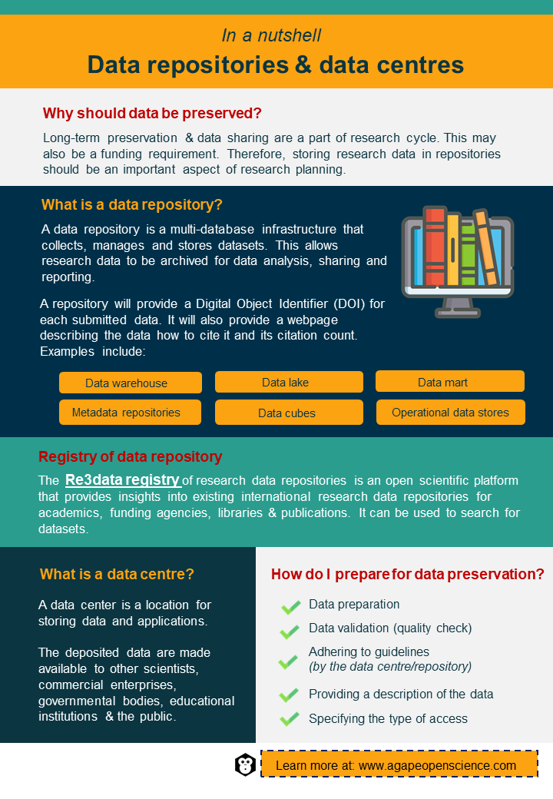

# Data repositories and data centres

::: mainfontFormat
Long-term preservation and sharing of data are a part of the data lifecycle and should be a part of your data management plan that you learned about in the "Research data" chapter. What's more, it can be one of the requirements of receiving funding. Therefore, storing research data of long-term value in data repositories or data centres should be an important part of your planning process.
:::

## Data repositories

::: mainfontFormat
A data repository is a set of data that has been isolated for the purpose of data reporting and analysis. The [data repository](http://digitalguardian.com/blog/what-data-repository) is a multi-database infrastructure that collects, manages and stores data sets for data analysis, sharing and reporting. Grouping data together enables easier and faster data analysis and using data repositories is a part of data management. Data can also be stored and archived in data repositories.

Examples of [types](https://stealthbits.com/blog/what-is-a-data-repository-and-what-is-it-used-for/) of data repositories include the following:

-   **Data warehouse** -- A data warehouse is a system that collects data from several sources into a single, central, consistent data storage system for use in data analysis, data mining, artificial intelligence and machine learning. Data warehousing helps in improving data quality by centralising data from various sources, including transactional systems, operational databases and flat files. The file is then cleansed and standardised and duplicates are removed to establish a single source for the file.

-   **Data lake** -- A data lake is a data warehouse without predefined schemas. As a result, it supports a wider range of analytics than a traditional data warehouse. The main distinction between a data lake and a data warehouse is that data lakes contain large amounts of unstructured data whereas the data in a data warehouse is structured.

-   **Data mart** -- A data mart is a simplified data warehouse which focuses on a single subject. It reduces the time and resources required to go through more complex data in a data warehouse or manually aggregating data from several sources. By using a data mart, teams can access data and obtain insights faster than using a data warehouse.

-   **Metadata repositories** -- Metadata provides fundamental information about data, making it easier to discover and operate with specific types of data. A metadata repository is a software which maintains descriptive data about the data model that is used to store and exchange metadata. Diagrams and text are combined in metadata repositories, allowing for metadata integration and updating. A metadata repository can also serve as the foundation for a data warehouse, among other things.

-   **Data cubes** -- A [data cube](https://www.metabase.com/learn/databases/data-cube) is a representation of the precise information that has to be extracted from a large quantity of complex data. A data cube is a structure designed to handle analytical queries. They contain metrics that have one or more regularly used dimensions. The metrics are precomputed, which means that a database job takes raw data, does computations and produces a new table to hold the results so that they can be queried instead of having to query and compute them from scratch each time. When data is aggregated depending on particular factors, numerous tables are layered on top of each other, creating a cube-like result. Data cubes group together various important data to allow for more flexible analysis, such as spotting trends. When data is organised into cubes, queries may be run significantly faster than if the tables were all kept separately.

-   **Operational data stores** -- An operational data store is used to keep comprehensive transactional data from several operating systems. It can function as a stand-alone operational system or as a temporary staging location for data until it is cleansed, processed and put into a data warehouse. An ODS receives data from other systems on a continual basis, either through real-time data replication or batch extract-transform-load processes. In most cases, data is kept in a denormalized manner. Operational data stores are useful for querying small datasets in real-time or near-real-time ([Kumar, 2019](https://stealthbits.com/blog/what-is-a-data-repository-and-what-is-it-used-for/)).

### Re3data -- research data repositories registry {.unnumbered}

A research data repository is the best approach to publishing and exchanging research data. A repository is an online database that allows long-term preservation of research data while also assisting others in finding it. A repository will provide a DOI for each submitted object and provide a web page that describes what it is, how to cite it and how many times other researchers have cited or downloaded it, in addition to archiving research data.

The [Re3data](https://www.re3data.org/) registry of research data repositories is an open scientific platform that provides an insight into the existing international research data repositories for academics, funding agencies, libraries and publications. The Humboldt University in Berlin, the German Research Centre for Geosciences (GFZ), the Karlsruhe Institute of Technology (KIT) and Purdue University all contribute to the register. By using a key-term search, the Re3data catalogue can be used to search for datasets. Results can also be filtered to show different fields such as social sciences, economics, anthropology, geography and the humanities. Also, the three browse functions -- subject, content type and country -- can be used to locate datasets. Data can be found by topic area using an interactive chart of disciplines and subdisciplines. Furthermore, data regarding the source repository are stated in the series metadata.

Some examples of popular data repositories for storing research data are [figshare](https://figshare.com/), [Mendeley Data](https://data.mendeley.com/), [Dryad](https://datadryad.org/stash), [Zenodo](https://datadryad.org/stash) and [Open Science Framework](https://osf.io/).
:::

## Data centres

::: mainfontFormat
While a data repository is a type of data library or data archive, a data centre also provides data asset management and services for the entire organisation through a series of platforms, tools, processes and specifications. A data centre refers to a location where data and applications are stored. Data centres make deposited data available to other scientists, commercial enterprises, government bodies, educational institutions and the general public. The architecture of a data centre is built on a network of computer and storage resources that allow shared applications and data to be transmitted. Data centres' architecture and functionalities have been greatly improved over time. The traditional on-premises physical server with virtual networks that support applications and workloads across groups of physical infrastructure has evolved into a multi-cloud system. As a result, data is now available and networked over numerous data centres, the edge and public and private clouds. Over time, data centres have increased their capacity to communicate with different locations both on-premises and in the cloud.

### Components of a data centre {.unnumbered}

The primary [components](https://centriq.com/blog/3-principles-of-data-center-infrastructure-design/) of a data centre are the computing unit, storage unit and network unit. The components of a data centre include computers, servers, routers or switches, a firewall or biometric security system, storage systems such as storage area networks or backup/tape storage, data centre management software/applications, power and cooling devices such as air conditioners or generators, physical server racks and chassis cables and an internet backbone.

### Data centre services {.unnumbered}

Data centres can help you to develop a DMP. Data centres offer services such as data storage, backup and recovery, data management and transfer for data of long-term value. Data can be made accessible openly or subject to restrictions and data centres often provide a searchable catalogue of data stored therein. Finally, data centres can issue DOIs.

### How to find the right data centre for research? {.unnumbered}

There are some critical factors to be considered in the choice of a data centre to host research data. After finding a data centre that specialises in a particular branch of scientific research, other considerations should include location, reliability, security, network service capacity, flexibility and scalability, emergency backup and reputation. If you are not sure you chose the right data centre, contact them. They'll be able to confirm or provide advice about better alternatives.

### How to deposit data in a data centre? {.unnumbered}

The process of depositing data starts with preparation of the data, validating the data (performing quality checks) and making it available in a form acceptable to the data centre. Before uploading the data to the data centre server, the guidelines stipulated by the data centre must be read and understood. Also, the owner of the data must be clearly defined and a brief description of the data should be provided. While open access of data is preferred, the data owner is expected to specify the type of access they wish to grant to their data. You can learn more about types of open access in the chapter "Open data and open access". Data are then uploaded and the upload is confirmed.

Because data cannot be modified after the upload, data must be in their final version before being deposited. The DOI for publication is also required when depositing data that contain datasets which support the publication, but some data centres can issue a DOI. You can learn more about DOI in the chapter "FAIR principles". The owner of the data is expected to indicate the type of access they wish to grant to their data. When a data set should have more than one type of open access, data must be stored separately in separate sections. Any scientific unit or research group's data must also be validated before being deposited in a data centre.

**Importance of PIDs**

A persistent identifier (PID) is a permanent and unique digital identification that helps users to locate and reuse digital content. PIDs are numbers that are used to identify digital items such as files, documents and web pages. Even if an organisation's web address changes, the PID will continue to function and ensures that a link to a digital item remains functional even if the object's location or web URL (Uniform Resource Locator) changes. Various options for a PID include Digital Object Identifiers (DOIs), Persistent Uniform Resource Locators (PURLs) and Archival Resource Keys (ARKs). Handle and OpenURL are examples of PID systems. Each system has its own set of characteristics, strengths and flaws.

Every dataset that is deposited and made accessible through a data centre will have a DOI, which is a form of PID. This ensures that the research is correctly cited, as well as indicating which version of the data was used. It is frequently a prerequisite to publish material based on these datasets in a publication where the research data are accessible and have a PID.

### Trends and future development {.unnumbered}

Due to the high energy consumption of data centres, there is a current trend to [shift to renewable sources of energy](https://bitpower.ie/images/Reports/2021_H1_Report.pdf). Renewable energy sourcing is standard, most data operators pay a premium to their suppliers for a 100% supply of certified renewable energy. Direct partnerships with renewable energy plants are becoming more popular globally. This demand for renewable energy will give the renewable industry much-needed investment, certainty and it may even minimise the need for REFIT (renewable energy feed in tariff) programmes for renewable energy.
:::

<div>


```{r, echo=FALSE, out.width="70%", fig.align = 'center'}

```

</div>

## Test your understanding

<iframe src="https://sa1987.github.io/AgapeOSQuizChapter-7?embedded=true" width="100%" height="600" frameborder="0" marginheight="0" marginwidth="0" style="border: 3px solid #3fb5bd;">

Loading...

</iframe>

::: activitybox
::: center
**Activities**
:::

::: notification
In a recommend activities section like this one, we will recommend the activities to increase your understanding of the concepts and improve your practical knowledge.
:::

-   Check out the [Digital Repository of Ireland](https://dri.ie/), the [UK Polar Data Centre](https://www.bas.ac.uk/data/uk-pdc/) and the [National Centre for Biotechnology Information](https://www.ncbi.nlm.nih.gov/). How would you deposit data in each of them?

-   Identify a data repository/data centre suitable for depositing your research data. Add it to your data management plan.

-   Did you find the previous two activities easy? Or were they a bit of a challenge? Share your experience and tips on data repositories/centres suitable for a specific type of data or research with others on our social media.
:::
