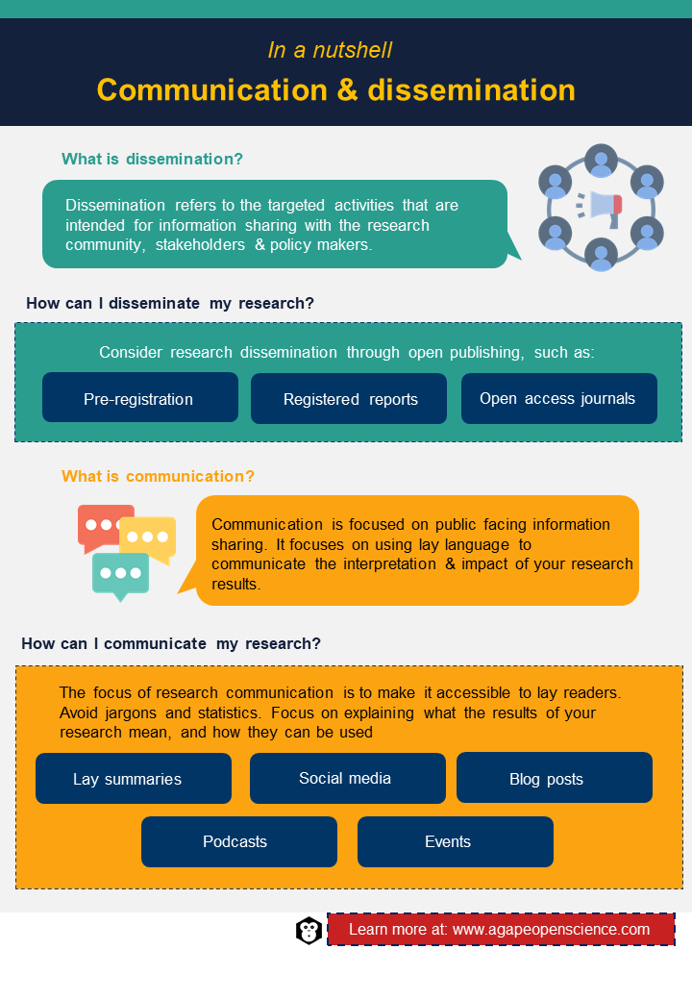

# Communication and dissemination

::: mainfontFormat
Now that you have gathered a background to open science, you are probably wondering what you should do next? Where do you even begin? As researchers, we are often encouraged to focus on academic communication such as journal articles and conference presentations. While this is the goal, there are so many other ways in which you can share your research, even before you get to the point of sharing your results. We are taught to use a language style that is often inaccessible to the majority. This chapter is going to take you through how open publications work, while also opening your eyes to other methods of communicating and disseminating your research in a more open and accessible way.
:::

## What exactly is scientific communication?

::: mainfontFormat
We often hear the terms dissemination and communication, but what do these terms mean? Wilson *et al.* ([2010](https://www.ncbi.nlm.nih.gov/pmc/articles/PMC2994786/)) defined dissemination as "a planned process that involves consideration of target audiences and the settings in which research findings are to be received and, where appropriate, communicating and interacting with wider policy and health service audiences in ways that will facilitate research uptake in decision-making processes and practice."

So, when we talk about **dissemination**, we are talking about the targeted activities in which you share information with others in the science community, stakeholders and even policy makers. It is focused on industry-specific knowledge exchange. This usually comes in the form of scientific journal publications or conference presentations that are often presented in a scientific language which is usually inaccessible to the general population.

**Communication**, on the other hand, is more focused on the public facing sharing of information. This is, by nature, the more open form of sharing information. The language is written in a lay format which focuses less on the scientific representation of results and more on the interpretation and impact of your results. This is often done through public events, newsletters, social media, etc.

For more information on the differences between dissemination and communication practices check out [LeitaT Project's blog](https://projects.leitat.org/communication-vs-dissemination-whats-the-difference/) post.
:::

## Open science publishing

::: mainfontFormat
While dissemination activities are often targeted, there are some publishing routes you can take to make your scientific publications more open. Publishing in open science allows you to share your full research journey, from conception of the idea and the research protocol to the results and impact of your research. The next few paragraphs will take you through different ways of disseminating your research through publications.

-   **Pre-registration**

To pre-register a study means that you specify the research plan and hypotheses prior to the data collection phase and submit this information to a public repository. This allows peers to review your plans, make comments and provide feedback before you begin the data collection period. Pre-registration also helps with some of the issues around publication biases. Examples of this are things such as not publishing negative results or hypothesising after results are known ([HARKing](https://pubmed.ncbi.nlm.nih.gov/15647155/)). When you pre-register your study, the journal conditionally accepts your future paper on this study regardless of the results, even if the results are not as you planned. While pre-registration is not a necessity for open science, it does allow for your research to be more accessible from the beginning.

If you're looking to pre-register your study, a good place to start is the [Open Science Framework](https://www.cos.io/initiatives/prereg). This is an easy-to-follow method for pre-registering your research in a multidisciplinary repository.

-   **Registered reports**

The next step in the open science publishing route is registered reports. This is where you go a step further from pre-registration and you submit your plan or protocol for your study to a journal. This report is focused on your research questions and methodology, but similarly to pre-registration, the journal you submit your registered report will agree to publish the results of your study if the reviewers believe that the plan for the study is clear and reaches a high scientific standard. These types of publications are most popular in the sciences in which a bias exists, for example in psychology, but are useful in all disciplines.

For more information on registered reports and to find a journal that suits your discipline, check out the [Centre for Open Science's](https://www.cos.io/initiatives/registered-reports) website.

-   **Open access journals**

Now that you've gathered your data and analysed it, the time has come to share this with the public.

Article Processing Charges -- Much like publishing articles in the traditional sense, article processing charges (APC) exist in open access journals. The [Directory of Open Access Journals](https://doaj.org/) provides a worldwide overview of what journals require APCs and, if they do, how much it will cost. Not all journals charge costs. And very possibly, your institution has a contract with many open access journals where you can publish for free.

You can also learn about types of open access publishing in the chapter "Open data and open access".
:::

## How to communicate your research

::: mainfontFormat
Now let's focus on how to communicate your research with the public. There are a few easy methods of doing it and making it accessible to the general reader. When using these methods, remember to avoid all jargon and statistics. The focus here is on what the results of your research mean and how they can be used. <br/><br/> **Lay summaries**

A good place to start when it comes to communication are lay summaries. A lay summary is a short summary avoiding academic jargon which describes your research. A good lay summary would be accessible to those who are outside of their specialty but also those in the general public. A good way to judge your summary is to ask yourself -- if I walked into a high school and described my research, would the students understand it? If yes, then well done. If not, then try again. <br/><br/> **Social Media**

Social media is a handy tool to share your research, if used correctly. These platforms allow you to showcase your research activities quickly and frequently for free. Social media platforms also offer this opportunity to see the impact your research is having in real time through live engagement metrics. This live engagement element gives you the chance to see who is interested in the research topic, who is sharing your research and who is talking about the topic. It can be time consuming to devote your efforts to managing social media accounts, especially if you manage more than one, but it can be worth it when people engage and ask questions about your research.

Social media is not new to academia. In fact, academia-specific platforms are being used in the form of [ResearchGate](https://www.researchgate.net/) and [Academia](https://www.academia.edu/). Despite this, many researchers chose to use the more "social" platforms such as [Twitter](http://www.twitter.com/) and [LinkedIn](http://www.linkedin.com/) to share research and join conversations. More recently, [Instagram](http://www.instagram.com/) and [TikTok](https://www.tiktok.com/en) are being used by researchers to share their research through visual means. A good example of this is \@[science.sam](https://www.instagram.com/science.sam/), a well-known Canadian science communicator who has made a career out of making science accessible and approachable to a general audience. [Dr. Samantha Yammine](https://www.samanthayammine.com/) uses multiple social platforms and media forms to showcase general science and her own specific research. You can check out her other social media platforms to see scientific communication in action.

Check out [this blog](https://theacademicdesigner.com/2019/social-media-platforms/) on the Academic Designer for a concise outline of all the different social media platforms available to you. Use this information to decide what platforms work for you and your research. Two questions to keep in mind when setting up a social media account for your research are "who is my target audience?" and "what platform will they use?". If your research will benefit teenagers, then creating a Facebook page will not work as that's not the platform teenagers use. <br/><br/> **Blog posts**

Blogs are a great way to share your research results, as well as your research journey. A lot of science communication is about sharing a story. Blogs open up this opportunity to share your research through stories in a reflexive manner. Not only does it offer you the opportunity to share the research, but you can also share the process you went through in undertaking the research. This offers a learning opportunity for others who wish to use similar methods to you.

The main barrier to blog posts is the platform you use. Setting up and managing an individual website to host a blog can be a time-consuming activity when you are in the middle of research activities. Many people do not want to host their own website, so they use institution or organisation sites instead. An example of an organisation's blog would be the [PLOS SciComm](https://scicomm.plos.org/) blog. The website hosts two types of blogs, those written by a team of staff members who are trained science communicators and independent blogs. Independent blogs are suggested by researchers on topics they write about as a guest on the website. For more information on this, check out the [about](https://plos.org/blogs/about/) section of this website.

Institutional blog posts are those which are hosted by the organisation supporting your research. Some institutions have blogs on the home website, while many research groups have their own individual blogs specific to their areas of interest. It is best to ask around and see if there is a blog already up and running. If not, make a suggestion to the communications team.

For more information and examples on science communication blogs check out [this post](https://www.animateyour.science/post/top-5-science-communication-blogs) by Dr. Miguel Balbin on Animate Your Science website. <br/><br/> **Podcasts**

Podcasts have been taking over the world in the last few years, so it's no surprise to see the science community start to take part. Podcasts are actually the audible form of a blog post. They are easily accessed on devices which connect to the Internet, allowing the general public the opportunity to listen in and learn. Some can be quite informal and conversational, while others are more organised and focused on a specific topic with a strict structure and questions. Similarly to blog posts, a major con to podcasts is the time-consuming element. Podcasts can be a lot of work, especially for one person. There are many steps, from idea generation to the actual recording of the episode, editing, uploading and the many other steps in between. Putting together a comprehensive podcast series takes patience and skill. A good first step if you are interested in podcasting is to be a guest for an episode. This allows you to get some experience and learn before you delve into the process.

Some relevant examples of podcast series which bring in multiple guests to share their own expertise and experience are [ReproducibiliTEA](https://soundcloud.com/reproducibilitea) and [ORION Open Science](https://www.orion-openscience.eu/publications/training-materials/201902/podcasts). These offer you more learning on the topic of open science. <br/><br/> **Events**

One final activity that encourages public engagement is public-facing events. These may be pre-existing events hosted in the community where you give a talk about your research or maybe an evening organised by your research group to showcase the work you are doing and the impact it may have on the local community. These public-facing activities don't need to be large or difficult to organise, it could be as simple as giving a talk in a local school or joining an already established event in an even more relaxed environment like a pub. Yes, the local bar. Check out the [Pint of Science](https://pintofscience.com/) website to see where your local event is and to sign up. Simple activities like these help you to gain more confidence and become a well-rounded science communicator.
:::

## Accessibility

::: mainfontFormat
We have spoken about making your research more accessible to the general public through lay language, but let's not forget making your research more accessible to those with accessibility issues. This is something of particular interest when we speak about communication. When creating social media posts there are a few considerations dependent on the mode of media you choose:

-   **Text** -- Is it easily transcribed into another language?

-   **Images** -- Can you provide [alt-text](https://abilitynet.org.uk/news-blogs/five-golden-rules-compliant-alt-text) to describe what is in the image for those who are colour blind or who may have difficulty seeing full images?

-   **Videos** -- Have you included subtitles for those who are hard of hearing?

Take a look at some of the free resources on [Ability Net](https://abilitynet.org.uk/free-resources/abilitynet-factsheets) to learn more about how you can make your communications even more accessible to those with extra needs. <br/><br/> **Bropen science**

Before we close out the chapter, one concept you should be aware of when going down the open science route of publishing and sharing your research is the term "bropen science". This term came about following a [viral tweet in 2017](https://www.bps.org.uk/psychologist/bropenscience-broken-science) after a female-led research team had their open research criticised. The term refers to the idea that open science practices, while they aim to be accessible, are still led by the rigid and hostile academic environment, which encouraged the open science movement to be born. While the term "bro" is used, this is not to suggest that this is a male-only agenda. A hostile environment can be created by anyone who is a "bro" and tries to discredit and, in many ways, bully individuals who are sharing the good, the bad and the ugly of their research. The problem does not just lie in the specifics of this event. This is not a debate on open science and gender, but a debate on open science and marginalisation.

When moving forward with your open science journey, the message here is -- don't be a bro! If you want to read more into the topic, check out [Pownall, Talbot and Henschel's 2021](https://journals.sagepub.com/doi/full/10.1177/03616843211029255) paper or for a more comprehensive overview of the events that led to the formation of the term, take a look at [Craig Harper's post](https://craigharper.substack.com/p/bropen-science?s=r).
:::

<div>


```{r, echo=FALSE, out.width="70%", fig.align = 'center'}

```

</div>

## Test your understanding

<iframe src="https://sa1987.github.io/AgapeOSQuizChapter-9?embedded=true" width="100%" height="600" frameborder="0" marginheight="0" marginwidth="0" style="border: 3px solid #3fb5bd;">

Loading...

</iframe>

::: activitybox
::: center
**Activities**
:::

::: notification
In a recommend activities section like this one, we will recommend the activities to increase your understanding of the concepts and improve your practical knowledge.
:::

-   Take some time to think about your research and how you want to share the knowledge that comes from it. Speak to your research team about possible dissemination and communication activities and work together to make a plan.

-   Pre-register your research. Check out what the standard is in your discipline. Once you've done so, share a link with others on our social media and don't forget to include the discipline of your research. This will help others who are also on this journey.

-   Create a lay summary of your research. Describe your research in 30 words or less. Share it with others on our social media.

-   Draft up a blog post which could be submitted for publication to your institution's blog. It could even be about your experience and plans for integrating open science into your research. If you're feeling extra brave, send it in. Once published be sure to share the link with others on our social media so we can see your learning in action.

-   Why not give designing an accessible infographic a go? Design an infographic explaining your research and share it with others on our social media. Try out free software such as [Canva](http://www.canva.com/) or [Piktochart](https://piktochart.com/).
:::
